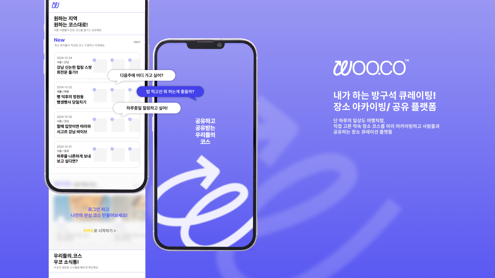

# WOOCO - 우리들의 코스
<a herf="https://wooco.kr"></a>
<div style="text-align: center;">

  
  
  
  

</div>

## 🔍 프로젝트 소개
> "우리들의 코스" **WOOCO**는, 지역 기반의 장소 리스트를 아카이빙하고 공유하는 커뮤니티 플랫폼입니다.
- 지역 필터와 관심사 기반의 **맞춤형 코스** 탐색
- 활동 후기, 코스 리뷰, 키워드 통계 등 **사회적 신뢰 기반의 콘텐츠** 제공
- 실시간 푸시 알림과 스켈레톤 UI 등 **모던 UX 기능 강화**

---

## 🛠 기술 스택

### 프론트엔드

  
  
    
  <br>
  
  
  

### 인증 및 지도 데이터
  

### 푸시 알림 메시지
  

### 모니터링
  

---

## 🧱 프로젝트 아키텍처: Feature-Sliced Design (FSD)

WOOCO의 소스코드는 [Feature-Sliced Design](https://feature-sliced.design/) 아키텍처를 기반으로 구성되어 있습니다.  
각 디렉토리는 [Barrel Exports](https://basarat.gitbook.io/typescript/main-1/barrel) 패턴을 위해 index.ts를 소유합니다. 

### 레이어 구조
```
src/
├── views/       # 페이지 및 라우팅 관련 컴포넌트 - 하위 요소를 조합하여 구성됩니다.
├── widgets/     # 복잡한 로직을 포함한 UI 블록 - 하위 요소를 조합하여 구성됩니다.
├── features/    # 사용자 시나리오 관련 기능 모듈 - 코스 생성, 리뷰 작성, 장소 검색 등을 포함합니다.
├── entities/    # 비즈니스 엔티티 관련 - 코스, 장소, 사용자 등의 엔티티가 여기에 정의됩니다.
└── shared/      # 프로젝트 전반에서 재사용되는 공통 요소 - 전역 상태 저장소, 메시지 프로바이더를 포함합니다.
```

---

## 프론트엔드 기여자
> WOOCO의 프론트엔드 개발자를 소개합니다!

### 박재영 [@yoouung](https://github.com/yoouung)
- **주요 기여 영역**:
  - 장소 리뷰 관련 view 개발 및 Rank 시각화
  - Feature-Sliced Design 기준 재수립 및 디렉토리 규칙 적용
  - 전역에서 사용할 모달 및 드롭다운 컴포넌트 개발
  - 리액트 쿼리 캐싱 최적화
  - 모바일 호환성 개선 (iOS 입력 폼 관련 이슈 해결)
  
### 이현도 [@HidenLee](https://github.com/HidenLee)
- **주요 기여 영역**:
    - 온보딩 페이지 애니메이션 구현  
    - Sentry 통합 및 오류 모니터링 구성
    - 장소 검색 및 리뷰 기능 개발
    - UI/UX 디자인 개선 및 버그 수정
    - 지역 선택 Cascader 컴포넌트 커스텀 구현

### 노현아 [@erica0321](https://github.com/erica0321)
- **주요 기여 영역**:
  - 프로젝트 전반 레이아웃 작성 및 화면 구현
  - app router 기반 페이지 네비게이션 설정
  - Feature-Sliced Design 적용을 위한 디렉토리 경로 설정 
  - 서버 연결에 리액트 쿼리 도입
  - 코드 컨벤션 확립 및 Lint 규칙 적용

---

## ✨ 주요 기능
> 이미지 추가 예정

| 페이지                     | 이미지                            |
|-------------------------|--------------------|
| **코스/플랜 생성 및 편집**       |      |
| **지도 기반 장소 검색 및 추가**    |           |
| **드래그 앤 드롭으로 장소 순서 변경** |          |
| **장소 및 코스 리뷰 작성**       |   |
| **코스 공유 기능**            |   |
| **스켈레톤 UI/로딩 최적화**      |  |

---

## 📁 환경 변수 설정
```.dotenv
# kakao map api signature
NEXT_PUBLIC_KAKAO_MAP_API_KEY=
NEXT_PUBLIC_KAKAO_REST_API_KEY=
NEXT_PUBLIC_SERVER_URL=https://dev.api.wooco.kr

# axios request signature
NEXT_PUBLIC_SECRET_KEY=
NEXT_PUBLIC_CUSTOM_TIMESTAMP_HEADER=X-Request-Timestamp
NEXT_PUBLIC_CUSTOM_SIGNATURE_HEADER=X-Request-Signature

# kakao oauth authentication signature
NEXT_KAKAO_CLIENT_ID=
NEXT_KAKAO_CLIENT_SECRET=

# sentry monitoring signature
SENTRY_AUTH_TOKEN=
```

---

## 🌐 API 문서
> Swagger를 통해 API 스펙 및 테스트가 가능합니다:
> 
🔗 https://dev.api.wooco.kr/swagger-ui/index.html

---

## 🧑‍💼  개발팀
> 즐거운 개발을 지향하는 우리는 Team_JOYTAS 입니다!
<div>
  
</div>


<table>
  <tbody>
    <tr>
      <td align="center"><a href="https://github.com/JiHongKim98"><br /><sub><b>BE 팀장 : 김지홍</b></sub></a><br /></td>
      <td align="center"><a href="https://github.com/junseoparkk"><br /><sub><b>BE 팀원 : 박준서</b></sub></a><br /></td>
      <td align="center"><a href="https://github.com/Namgyu11"><br /><sub><b>BE 팀원 : 하남규</b></sub></a><br /></td>
    </tr>
    <tr>
      <td align="center"><a href="https://github.com/yoouung"><br /><sub><b>FE Leader : 박재영</b></sub></a><br /></td>
      <td align="center"><a href="https://github.com/HidenLee"><br /><sub><b>FE 팀원 : 이현도</b></sub></a><br /></td>
      <td align="center"><a href="https://github.com/jaeheekim-wp"><br /><sub><b>UI/UX : 김재희</b></sub></a><br /></td>
    </tr>
  </tbody>
</table>

---

## 🤝 기여 방법
> 본 프로젝트는 팀 개발 중인 전용 레포입니다.
- PR은 받지 않습니다.
- 다만 버그나 기능 제안은 언제든지 Issue로 남겨주세요!

---


## 🔫 트러블슈팅 (Troubleshooting)
> WOOCO 개발 중 고민했던 항목을 추가할 예정입니다.

---

## 📅 우리의 발자취 (Project History)
| 날짜           | 릴리즈 버젼 | 상세 내용           |
|--------------|--------|-----------------|
| `2025.06.13` | 1.1    | README.md 초안 작성 |


---
